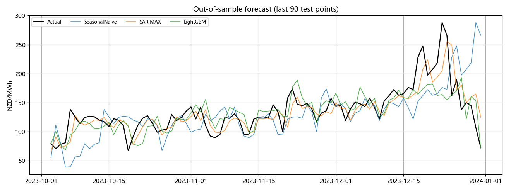
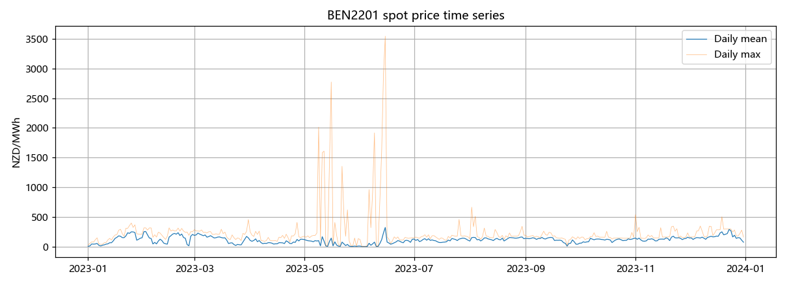
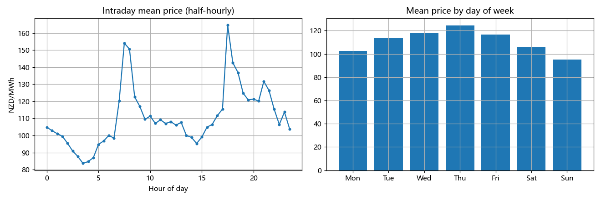
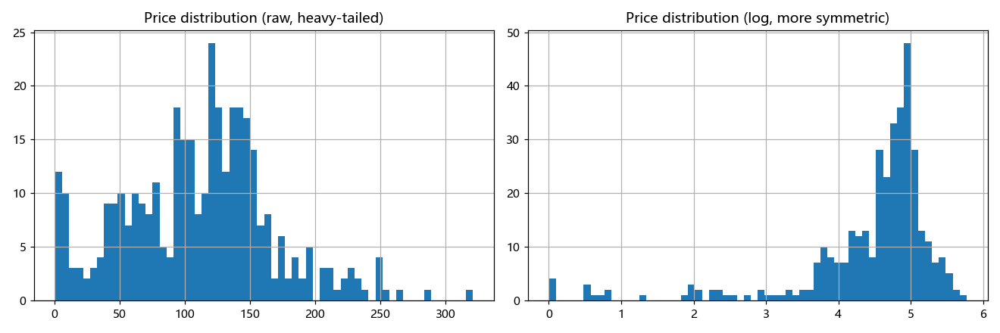
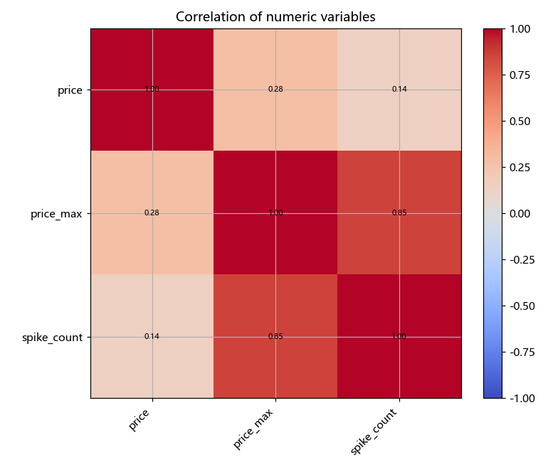

# NZEM Spot Price Forecasting

End-to-end forecasting of New Zealand Electricity Market (NZEM) half-hourly spot
prices, using **real final energy prices** published by the **Electricity Authority** via
the **EMI** platform ([emi.ea.govt.nz](https://www.emi.ea.govt.nz)).

Two data modes, switched by one flag in `config.yaml`:
- `use_synthetic: false` (default) — downloads **real EMI final energy prices** for the
  chosen node and date range, caching the monthly files locally.
- `use_synthetic: true` — a built-in, NZEM-flavoured synthetic generator so the full flow
  runs with no internet (useful for quick checks / demos).

> Interview one-liner: *"I built a full NZEM spot-price forecasting pipeline on real EMI
> final energy prices (node BEN2201, 2023) — EDA, feature engineering, and a SARIMAX vs
> LightGBM vs seasonal-naive comparison under walk-forward validation. SARIMAX roughly
> halved the seasonal-naive baseline's MAE (31.9 → 16.6 NZD/MWh)."*

---

## Quick start

```bash
# from this folder
pip install -r requirements.txt
python run_pipeline.py            # real EMI data; first run downloads ~120 MB, then cached
python run_pipeline.py --no-cv    # skip walk-forward CV (faster)
```

Outputs:
- `outputs/reports/report.md` — metrics table, EDA notes, feature importance, next steps
- `outputs/figures/*.png` — time series, seasonality, distribution, correlation, forecast
- `02_data/processed/*.csv` — cleaned half-hourly + modelling dataset
- `02_data/raw/emi_cache/*.csv` — cached monthly EMI files (re-runs are fast & offline)

## Pipeline

```
download → preprocess → EDA → features → models → backtest → report
```

| Stage | Module | What it does |
|---|---|---|
| Data | `src/data/download.py` | real EMI monthly downloader (cached) + synthetic fallback |
| Clean | `src/data/preprocess.py` | half-hourly grid, DST/timezone, gaps, spike flagging, daily aggregation |
| EDA | `src/eda/explore.py` | intraday/weekly seasonality, heavy-tailed distribution, correlations |
| Features | `src/features/build_features.py` | lags, rolling stats, cyclical calendar encodings, exogenous vars |
| Models | `src/models/` | `SeasonalNaive`, `SARIMAX` (+ exog), `LightGBM` behind one interface |
| Eval | `src/evaluation/backtest.py` | one-step-ahead hold-out + walk-forward expanding CV; MAE/RMSE/sMAPE |

## Why these modelling choices (the talking points)

- **Node-level pricing**: NZEM uses nodal (locational) prices across ~280 nodes, not a
  single national price. The pipeline models one representative node (`BEN2201`, Benmore)
  — set `data.node` in `config.yaml`.
- **Hydro is the market's soul**: NZ generation is hydro-dominated, so price spikes track
  low storage + high demand. The EMI *final energy prices* file is price-only; demand and
  hydro storage live in separate EMI datasets. The pipeline treats `demand`/`storage` as
  optional exogenous inputs to SARIMAX and features for LightGBM — present in the synthetic
  mode and ready to wire in from EMI (see below). A great thing to explain in an interview.
- **Seasonal-naive baseline first**: in energy forecasting the seasonal-naive (last week,
  same day) baseline is notoriously hard to beat; every complex model must prove it wins.
- **Walk-forward, not random K-fold**: time-series CV uses expanding windows so we never
  train on the future. All models are scored strictly one-step-ahead.
- **Heavy tails**: prices are right-skewed with spikes; tree models handle this natively,
  linear/SARIMAX can use a log target. Spikes are flagged, never silently deleted —
  they're real market signal.

## Configuration (`config.yaml`)

Key knobs: `data.node`, date range, `data.use_synthetic` (true/false),
`modeling.target_freq` (`D` for daily — fast & SARIMAX-friendly; `30min` for half-hourly,
where LightGBM shines), `modeling.test_days`, `modeling.cv_splits`,
`features.lags`, `features.rolling_windows`.

## Real EMI data (wired in)

Prices come from EMI's **Final energy prices → ByMonth** dataset:

```
https://www.emi.ea.govt.nz/Wholesale/Datasets/DispatchAndPricing/FinalEnergyPrices/ByMonth/{YYYYMM}_FinalEnergyPrices.csv
```

Columns: `TradingDate, TradingPeriod (1–48), PointOfConnection, DollarsPerMegawattHour`.
`src/data/download.py` downloads each month in the configured range, filters to
`data.node`, converts `TradingPeriod` → a half-hourly timestamp, and caches the raw monthly
files under `02_data/raw/emi_cache/`. DST days (46/50 periods) are absorbed by the
preprocess step's grid-rebuild + interpolation.

**Adding demand / hydro storage (next step):** these are separate EMI datasets. Download
them similarly, map their columns to `demand` / `storage` in
`src/data/preprocess.py::_coerce_schema`, and the rest of the pipeline (SARIMAX exog,
LightGBM features, EDA correlations) picks them up automatically.

> The synthetic mode (`use_synthetic: true`) reproduces real NZEM features (intraday double
> peak, weekend dip, southern-hemisphere winter demand, mean-reverting hydro storage,
> scarcity-driven spikes) so you can develop offline before hitting the real data.

## Project layout

```
electricity_price_forecasting/
├── run_pipeline.py            # end-to-end entry point
├── config.yaml                # all settings
├── requirements.txt
├── src/
│   ├── data/        download.py, preprocess.py
│   ├── eda/         explore.py
│   ├── features/    build_features.py
│   ├── models/      base.py, baseline.py, sarimax_model.py, lgbm_model.py
│   ├── evaluation/  backtest.py
│   └── utils/       io.py
├── 01_market_knowledge/      # market notes + learning TODO
├── 02_data/                  # raw + cached EMI files
└── outputs/                  # figures + report
```

## Results (real EMI data)

Real EMI final energy prices, node `BEN2201` (Benmore), 2023, daily mean, 90-day hold-out,
one-step-ahead:

| model | MAE | RMSE | sMAPE% |
|---|---|---|---|
| **SARIMAX** | **16.59** | 23.83 | 12.28 |
| LightGBM | 20.18 | 29.21 | 14.63 |
| SeasonalNaive | 31.85 | 46.40 | 23.87 |

SARIMAX roughly **halves** the seasonal-naive baseline's MAE (31.9 → 16.6 NZD/MWh).
Mean price ~115 NZD/MWh on weekdays vs ~101 on weekends, with the intraday peak around
17:30 — all consistent with real NZEM behaviour. Adding demand and hydro-storage exogenous
series (separate EMI datasets) is the obvious next lever, especially for the spike days
that dominate the remaining error.

Out-of-sample forecast (last 90 test points), all three models vs actual:



### Figure gallery

| Price time series | Seasonality |
|---|---|
|  |  |

| Price distribution | Correlation |
|---|---|
|  |  |

The full metrics table, EDA notes, and LightGBM feature importances are in
[`outputs/reports/report.md`](outputs/reports/report.md).

## License

Released under the [MIT License](LICENSE).
